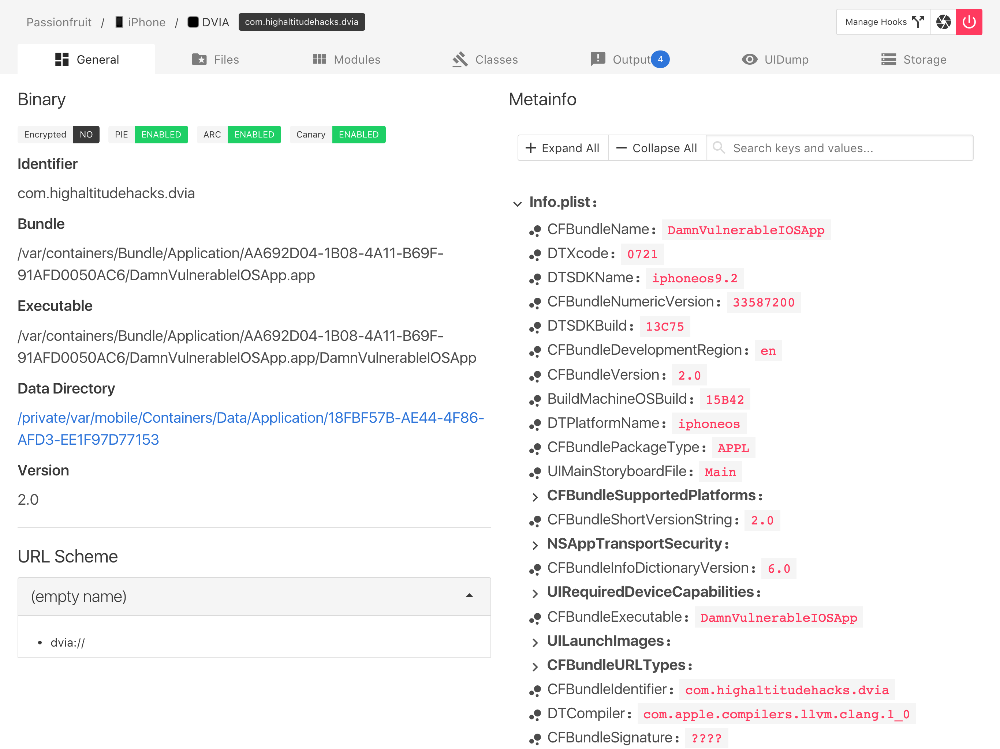
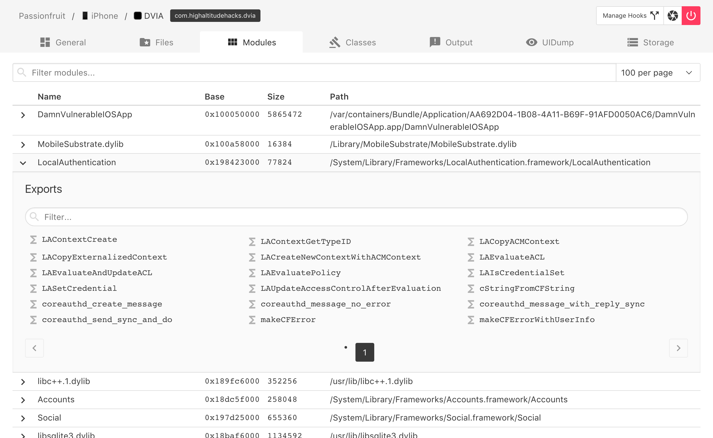
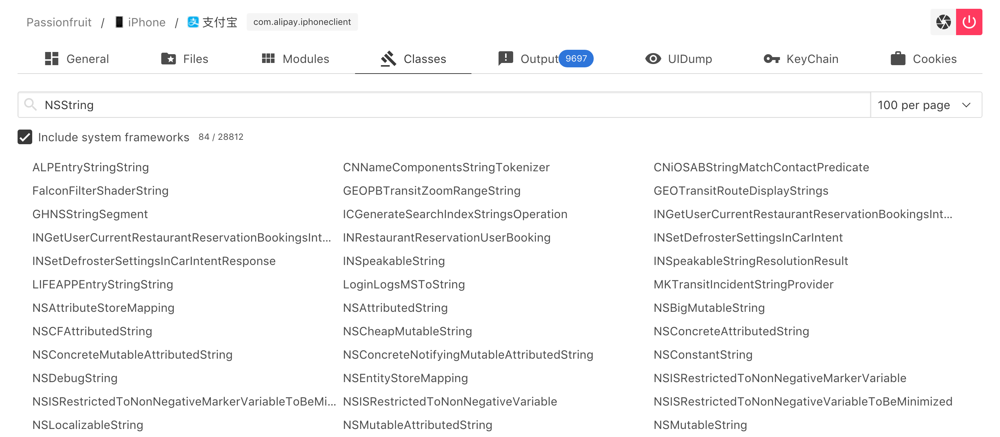
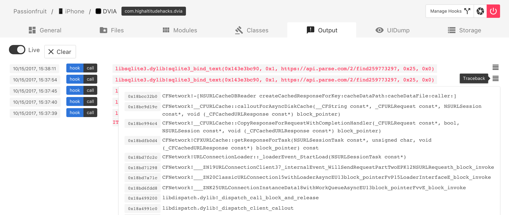

# Passionfruit

Simple iOS app blackbox assessment tool. Powered by [frida.re](https://www.frida.re) and [vuejs](https://www.vuejs.org).

## Features

* **Fully web based GUI!**
* Only supports jailbroken device now. Non-jailbroken solution is on the way.
* List all url schemes.
* Screenshot
* List human readable app meta info (Info.plist).
* Checksec: see if target app is encrypted, and has enabled PIE, ARC and stack canary.
* App sandbox file browser. Directly preview images, SQLite databases and plist files on device. You can always download the file for further investigation.
* Check the loaded frameworks. Hook exported native functions from these dylib to print the arguments and stack trace.
* List Objective-C classes from app, hook the methods and inspect the arguments and stack trace.
* Read keychain items.
* Read cookies.
* Simple ui dump.

## Screenshots


Apps list.



Checksec, url schemes and metainfo.


File browser with hex viewer, image viewer, plist viewer and SQlite database reader.



Loaded frameworks and their exported symbols.




Objective C classes and methods.



Intercepted calls, arguments and stack trace.


Dump ui description of the key window.

## Setup

Requirements:

* Latest [node.js](https://nodejs.org/) and [yarn](https://yarnpkg.com/) (or [npm](https://www.npmjs.com) if you prefer) to run the api server and web gui
* [theos](https://github.com/theos/theos) for building the tweak component
* Any desktop browser you like

### Building agent tweak

Make sure you have theos installed, see [theos installation](https://github.com/theos/theos/wiki/Installation)

```shell
cd agent
make package
```

Deploy generated `.deb` to your jailbroken iOS device.

### Starting the gui

This is the easiest way to start if you don't want to modify the project.

* Open the terminal and `cd` into the project directory.
* If it is the first time you cloned this project, you need to install npm dependencies and build the frontend. Run `npm install` or `yarn` for the node.js requirements on the first time. Then `npm run build` (or `yarn run build`) to build the bundle.
* Then use `npm start` or `yarn start` 
* Open `http://localhost:31337` in your browser. If the port 31337 is in use, set environment variable `PORT` to use an alternative port: `PORT=12345 npm start`

### Development (optional)

For those who wants to contribute, you may probably need to restart the api server and reload webpage  each time you make a change. The following steps enable livereload.

#### API server

```shell
yarn
npm run dev
```

#### Webpack server

```shell
cd gui
yarn
npm run dev
```

Now open localhost:8080 in browser.

## LICENCE

MIT
